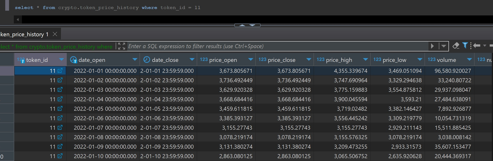

# Tracking token prices on the ETH block chain (ERC20 tokens)

From my lack of prior knowledge trying to wrap my head around the ethereum market has been tough to say the least , clouded much more so in seemingly endless third party endpoints throwing out buzzwords without detailing what they mean.

For this entry I wanted to go over the trials and tribulations I've been facing with tryigt to get historical price information for the ETH blockchain, intially I thought that there was an overall value pricing for the entire chain but boy was I wrong. The way ethereum (and by extension most crypto currencies) handles its token prices is related to specific 'smart contracts' that represent a specific 'token' types value, a list of the top 50 can be found [`here`](https://coinranking.com/coins/erc-20) , for the sake of simplicity I will be trying to track the historical prices of the first 3 tokens from that list : 
- `Tether`
- `Wrapped BTC`
-  `Lido staked Ether`

(You may notice this is not actually the top 3 results from that list , this is becuase some tokens do not contain an etherium contract address , meaning they are not traded on the ethereum blockchain, for this project we are ONLY workign with the ethereum block chain...  for now? ...)

with the volitile nature of the Lido coin / wrapped BTC being good control variables for any predictive models I try to build , at this stage I am assuming that each one of these coins will require their own model for the greatest accuracy.

Interestingly Ethereum Coin itself is a coin developeed on the ethereum blockchain system which actually allows users to create their own decentralized coins/ apps (DApps) running on the same technology, hence the need to individualive smart contracts and in my opinion the confusing nature of trying to unpack whatever the hell ethereum actually is.

With [`this article`](https://www.bitcoin.com/get-started/difference-between-bitcoin-and-ethereum/) helping me somewhat, it highlights how Ethereum is a platform **AS WELL AS** a currency itself, with the platform allowing developers to use Ethereum technology in a variety of ways it has become the forefront of the NFT market.

For the current state of this project though I will not be diving too deeply into the how and why of NFT's and DApps, instead I want to build data visualisation similar to https://coinranking.com/coin/aKzUVe4Hh_CON+usdc-usdc showcasing the trend over time of certain coins, such that I can then later build ML models against this data.

As stated in [My first entry](../devlog/entry1.md) I manged to find a completely FREE to use api for tracking OHLC prices, requiring a token_address that can be found in the above supplied list of top coins, I can track the daily price ranges to build a candlestick graph from.

Starting with Tether USD, though the coin itself has a number of contract addresses for various chains I will be focusing purely on the ethereum contract address see : https://coinranking.com/coin/HIVsRcGKkPFtW+tetherusd-usdt 
This coin itself is interesting in that it is attamptingto be standardived as 1:1 with USD as a way of bridging crypto to real world finanaces, as such it is fairly stable and does not shift in value. I will be using the above graph as a way of validating my data visualisations...


After implementing the OHLC history api and finding the correct contract adress I can now being pulling in some historical pricing data.

Firslty accessing the endpoint with the correct params : 

```python
params = {
    'token_address' : '0xdAC17F958D2ee523a2206206994597C13D831ec7',
    'pool_address' : 'all',
    'chain' : 'eth',
    'interval' : '1d',
    'order' : 'desc',
    'open_method' : 'first_trade',
    'max_size' : 1000
}

resp  = requests.get(secret['endpoint'],params=params)
resp.status_code
```

from here we can start storing our data, for this I have created the following 2 tables :

```sql
create table crypto.token (
	id INTEGER serial primary key,
	"name" VARCHAR(50) not null,
	identifier VARCHAR(10) not null,
	chain VARCHAR(10)
);

create table crypto.token_price_history (
	token_id INTEGER,
	date_open TIMESTAMP without TIME zone not null,
	date_close TIMESTAMP without TIME zone not null,
	price_open Numeric(10,6),
	price_close Numeric(10,6),
	price_high numeric(10,6),
	price_low NUMERIC(10,6),
	volume NUMERIC(15,6),
	num_trades INTEGER,
    periodicity VARCHAR(3) not null,
	constraint fk_token_id foreign key (token_id) references crypto."token" (id) on update cascade on delete cascade,
	constraint token_id_date_open_pk primary key (token_id,date_open)
);

```
ETL process:

    - 1) EXTRACT data from OHLC endpoint
    - 2) TRANSFORM data into pandas data frame , coercing columns and filtering out extra data I'm not interested in
    - 3) LOAD :
        - firstly to cover future useage I will check a token data record exists in crypto.token, if not create one and use that token_id to join on
        - load price history records injecting token_id into df allowing pk (token_id , date_start) to have 1 row per day per token

For the extractio stage I decided to take some time to practice mainatainable code , Using pydantic to build models for api requests ensures that even though im using pyhton (dynamically typed) I can enforce the construction of query params into statically typed models eg.

see : https://syve.readme.io/reference/price_historical_ohlc
```python
class OHLCPricesRequest(BaseModel):
    token_address : str = Field(...,title='Contract Address for token.')
    pool_address : str = Field('all', title='The address of the liquidity pool from which the OHLC prices will be fetched.')
    chain : str = Field('eth', title='Chain to pull price history from.')
    price_type : str = Field('price_token_usd_robust_tick_1' , title='This parameter determines what price to use to create OHLC with.')
    interval : str = Field('1d', title='Interval to return aggregate stats for , 1d = daily 1m = minuite')
    from_timestamp : int = Field(...,title='Return results whose timestamp_open are greater than or equal to the provided value.')
    until_timestamp : int = Field(...,title='Return results whose timestamp_open are less than or equal to the provided value.')
    max_size : int = Field(2500,title='Maximum number of records to return',gt=0,lt=2501)
    order : str = Field('asc',title='Return in asc or desc order')
    fill : bool = Field(False, title='flag to forward fill gaps in trade')
    with_volume : bool = Field(True , title='Return volume information with resp.')
    open_method : str = Field('first_trade', title='Determines how to calculate the open price.')

    @field_validator('price_type')
    def price_type_validator(cls, value : str, info: ValidationInfo):
        price_types = [
            'price_token_usd_tick_1',
            'price_token_usd_robust_tick_1',
            'price_token_usd_robust_total_{1h|24h}',
            'price_token_usd_robust_buy_{1h|24h}',
            'price_token_usd_robust_sell_{1h|24}',
            'price_token_usd_robust_mid_{1h|24h}'
        ]
        assert value in price_types, f'valid price types are : {price_types}'
        return value
    
    @field_validator('chain')
    def chain_validator(cls, value : str, info: ValidationInfo):
        chains = [
            'eth',
            'matic'
        ]
        assert value in chains, f'Valid chains are : {chains}'
        return value
    
    @field_validator('open_method')
    def open_method_validator(cls, value : str, info: ValidationInfo):
        open_methods = [
            'first_trade', 'prev_close'
        ]
        assert value in open_methods , f'Valid open_methods are : {open_methods}'
        return value
    
    @model_validator(mode='before')
    def validate_timestamps(cls , values) -> dict:
        """
            from_timestamp and until_timestamp are both integers Unix EPOCH times,
            this method is just to validate that the range is appropriately initilized

            in our case we will accept string in the format yyyy-mm-dd and explicitly convert them to datetime for 
            validation , then to unix Epoch.
        """
        dt_cols = ['from_timestamp' , 'until_timestamp']

        for col in dt_cols:
            try:
                values[col] = datetime.strptime(values[col],'%Y-%m-%d').timestamp()
            except Exception as e:
                print(e)
                raise ValueError(f'{col} must be supplied as a str in the yyyy-mm-dd format...')
        
        assert values['from_timestamp'] < values['until_timestamp'], 'from_timstamp must be before until_timestamp'
        return values
```

From this I can confidently construct my api calls with the correct params, as well as enforce defaults where necessary.

After calling the OHLC endpoint to get my data and upserting it into the db I can query my database for the necessary data filtering on token_id for specific coins: 



<<<<<<< Updated upstream
=======
# Devlog
- [entry3](devlog%20entry3.md)

>>>>>>> Stashed changes


