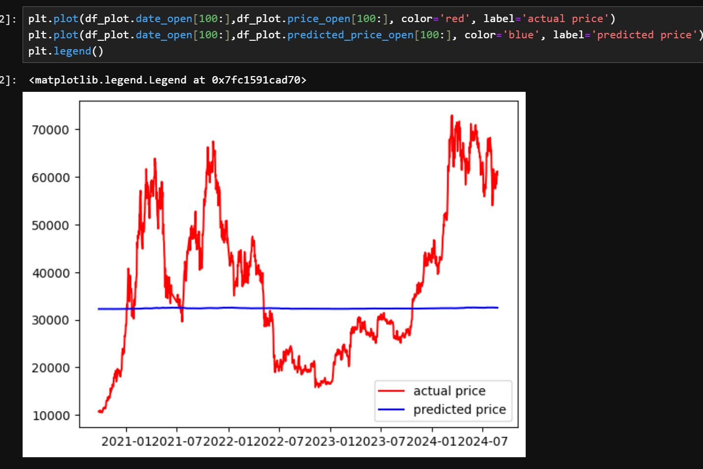
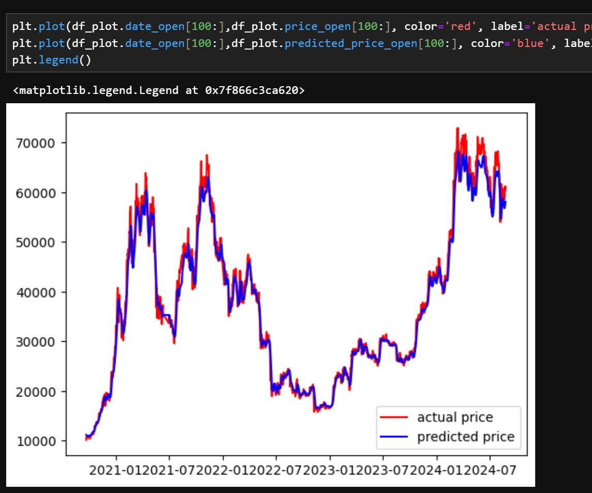

# Training an LSTM model agaisnt OHLC historical data...

LSTM'S broadly are models buildt for time series data that use previous data along with current input to determine an expected output.  

LSTM (Long Short Term Memory) are a type or RNN (recurrent nueral network) that contain multiple layers that communicate with one another, containing 3 types of gates , the input , forget and output gates that all work using sigmoid activation function of which is non linear witha normalized output, representing a scale of 0 (data to omit) to 1 (data to include).

## Preliminary research

Why use LSTM:

LSTM's are built for time series based input , though in most real world use cases (specifically for market prediction) LSTM's are used in conjunction with sentiment analyis on stock news reports such that the trending news data (reduced to a sort of +ve or -ve scale metric) is used in conjunction with historical prices, which makes snese since market states are heavily volatile and rely greatly on credibility and real world events to be evaluated correctly, for this stage in my project however I am not concerning myself with this as it would require a lot more data gathering / processing work before running an LSTM.

Though should I get round to it I would like to try using scrapy to scrape data from known sources , which could then be embedded using openAI txt_embedding_3_large model for training / running sentiment anaylsis against, or even using an NLP for this.

Alternative model approaches:

- SAAN
- 

To begin with I decided to follow along with [this tutorial](https://www.simplilearn.com/tutorials/machine-learning-tutorial/stock-price-prediction-using-machine-learning#stock_price_prediction) by Avijeet Biswal of which has some good easy to follow explanations of LSTM models for market prediction.

## Installation

When following along with the above tutorial , everything was going well until trying to install the keras pyhton module, keras requires tensorflow to be installed to utilize some keras 3 functionality, when installing tensorflow some dependancy conflicts were raised , it seems that tensorflow is incompatabile with numpy versions >= 2.0.0 , see : [this thread](https://github.com/numpy/numpy/pull/15355)

With that in mind , and considering I wasn't using numpy aywhere else in this proejct just yet , I decided to downgrade my numpy version to match, users seem to be in conversation regarding an API vs ABI issue being the root cause of the incompatability but I wont pretend to known enough about either packages inner workings to join the debate.

## Training

There is much abstarcted when training models using existing libraries such as skikit learn , this is mainly due to the seemingly endless iceberg on the inner working on how and why ML archetecture operates the way it does, the rabbit hole is deep, espcially when considering differnet applicable optimisation techniques , loss functions etc.

I am splitting my input data into test/train splits using scikit leanrs handy [test_train_split function](https://scikit-learn.org/stable/modules/generated/sklearn.model_selection.train_test_split.html)

The intial training run yielded roughly a 0.07 loss score , though this could easily be due to overfitting...

## Testing

As you can see from my first attempt something had gone dramatically wrong ...

This is likely down to how I've been shaping / pre processing the input data to the model , I ran across [this article](https://medium.com/@palakgupta33939/why-is-reshaping-of-data-important-for-lstm-models-4652332be168) by Palak Gupta detailing the importance of correct input shaping.

Thankfully though this was not the case, instead it was due to the final LSTM layer I added to the regressor being set to return_sequenes=True , this caussed the input sequence to be returned to the output of that said layer , meaning it expects to move onto a nother LSTM layer instead of calculating the final output from the current stack, simply setting this to False fixed the issue:

## Overfitting

In ML context overfittting occurs when a model has been trained to closely to the training data supplied to it , meanning it lacks the ability to generalize the results for new incoming data.

TODO

